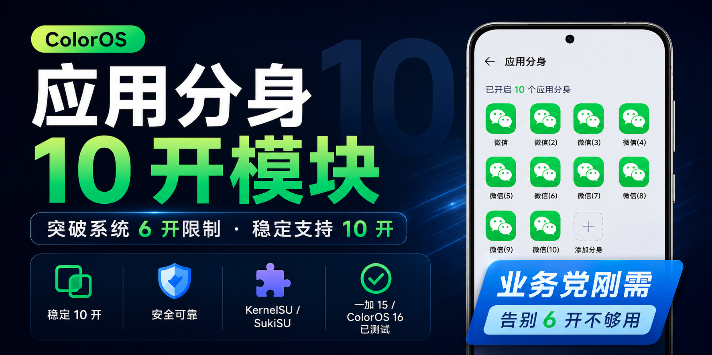
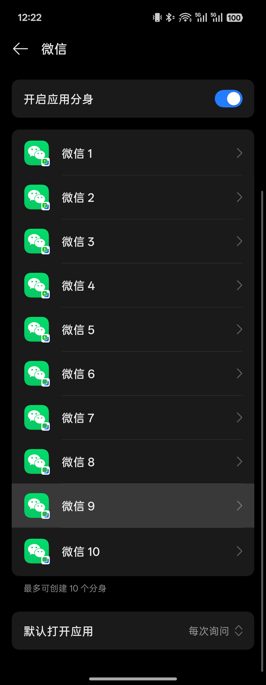
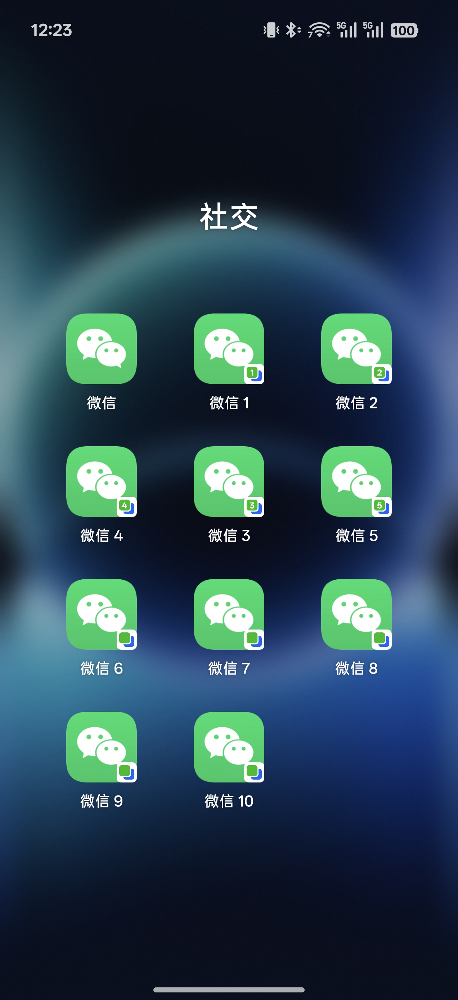

# ColorOS系统应用分身设置为10

作者：Rainto0820

这是一个用于 ColorOS 16系统应用分身的 SukiSU / KernelSU 模块，用来把系统应用分身数量稳定设置为 10 个。

## 下载

请到 Releases 下载正式安装包：

[下载 v1.1](https://github.com/Rainto0820/ColorOS-MultiApp-10/releases/tag/v1.1)

## 更新记录

### v1.1

- 修复部分机型安装后，已经开启若干应用分身时，其他未开启应用显示灰色、无法继续开启分身的问题。
- 继续保持最多 10 个分身，不突破系统原生预留的稳定用户范围。

### v1.0

- 首个稳定版本，将 ColorOS 16系统应用分身数量设置为 10 个。

## 为什么只设置为 10 个

目前测试的系统里，ColorOS 系统原生预留的应用分身用户 ID 范围是 `990-999`，正好对应 10 个分身用户。

继续突破到第 11 个分身时，系统会使用 `989` 等未验证范围。实测这会导致系统卡顿、界面无响应，甚至需要手动删除第 11 个分身用户才能恢复。

所以这个模块只做稳定的 10 个分身，不继续突破 10 个。

后续会继续研究有没有更稳的方法突破 10 个分身上限。

## 已测试环境

- 一加 15
- ColorOS 16 金标
- SukiSU Ultra

其他 ColorOS 16 机型暂未验证，安装前建议先做好备份。

## 实测截图

  
  

## 安装方式

1. 在 SukiSU / KernelSU 管理器中刷入模块 zip。
2. 重启手机。
3. 打开系统应用分身，创建需要的分身。

## 注意事项

- 不建议与其他修改应用分身上限的模块同时启用。
- 不建议尝试创建第 11 个及以上分身。
- 如果系统异常，先禁用本模块并重启。
